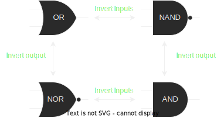

# Boolean logic

## Fundamental gates

|  A  | NOT |
| :-: | :-: |
|  0  |  1  |
|  1  |  0  |

|  A  |  B  | AND |     |  A  |  B  | NAND |     |  A  |  B  | OR  |     |  A  |  B  | NOR |     |  A  |  B  | XOR |
| :-: | :-: | :-: | --- | :-: | :-: | :--: | --- | :-: | :-: | :-: | --- | :-: | :-: | :-: | --- | :-: | :-: | :-: |
|  0  |  0  |  0  | --- |  0  |  0  |  1   | --- |  0  |  0  |  0  | --- |  0  |  0  |  1  | --- |  0  |  0  |  0  |
|  0  |  1  |  0  | --- |  0  |  1  |  1   | --- |  0  |  1  |  1  | --- |  0  |  1  |  0  | --- |  0  |  1  |  1  |
|  1  |  0  |  0  | --- |  1  |  0  |  1   | --- |  1  |  0  |  1  | --- |  1  |  0  |  0  | --- |  1  |  0  |  1  |
|  1  |  1  |  1  | --- |  1  |  1  |  0   | --- |  1  |  1  |  1  | --- |  1  |  1  |  0  | --- |  1  |  1  |  0  |

 

## Basic Boolean Algebraic Identities and Properties

|     ADDITIVE      |                  | MULTIPLICATIVE |
| :---------------: | ---------------- | :------------: |
|     A + 0 = A     |                  |     0A = 0     |
|     A + 1 = 1     |                  |     1A = A     |
|     A + A = A     |                  |     AA = A     |
|     A + Ā = 1     |                  |     AĀ = 0     |
|                   |                  |                |
|     A+B = B+A     |                  |    AB = BA     |
| A+(B+C) = (A+B)+C | A(B+C) = AB + AC | A(BC) = (AB)C  |

 

## Boolean rules for semplification

|                          |
| :----------------------: |
|        A + AB = A        |
|      A + ĀB = A + B      |
| (A + B) (A + C) = A + BC |

 

## De Morgan's Theorems

|                           |
| :-----------------------: |
| Not(AB) = Not(A) + Not(B) |
| Not(A + B) = Not(A)Not(B) |

 
 

 
 

We can use De Morgan's laws and boolean arithmetic and rule from semplifications to go from truth tables to logic circuits using Sum of Products for 1 or Product of sums for 0.
